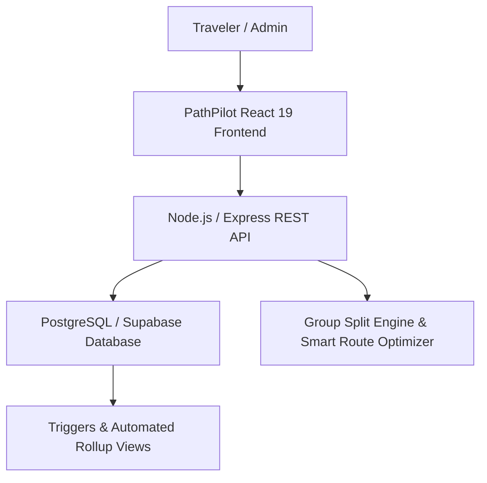

<p align="center">
  
</p>

<h1 align="center">PathPilot 🧭</h1>

<p align="center">
  <strong>Every Journey Needs a Pilot.</strong><br />
  An intelligent, modern, multi-city travel planning platform built with React 19, TypeScript, Node.js, Express, and PostgreSQL / Supabase.
</p>

<p align="center">
  <a href="https://github.com/nishit546/PathPilot/blob/main/LICENSE"></a>
  <a href="https://nodejs.org/"></a>
  <a href="https://react.dev/"></a>
  <a href="https://www.typescriptlang.org/"></a>
  <a href="https://www.postgresql.org/"></a>
  <a href="https://supabase.com/"></a>
</p>

---

## 📑 Table of Contents

- [Overview](#-overview)
- [Key Features](#-key-features)
- [Architecture & Tech Stack](#-architecture--tech-stack)
- [Repository Structure](#-repository-structure)
- [Quick Start & Local Setup](#-quick-start--local-setup)
- [Pre-Seeded Test Accounts](#-pre-seeded-test-accounts)
- [Database Schema & Views](#-database-schema--views)
- [API Reference](#-api-reference)
- [License](#-license)

---

## 🌟 Overview

**PathPilot** eliminates the chaos of modern travel planning. Rather than juggling dozens of disparate browser tabs, spreadsheets, and messaging apps, PathPilot brings your complete travel lifecycle into one unified, collaborative dashboard:

1. **Multi-Stop Itinerary Sequencing**: Structure multi-city journeys, arrival/departure schedules, and auto-generated daily plans.
2. **Dynamic Day-Wise Scheduling**: Assign curated sights, heritage tours, culinary walks, and custom activities with time slots and budget allocations.
3. **Smart Budget & Expense Engine**: Track real-time category spending against allocated budgets with pre-computed database rollups.
4. **Group Expense Splitting & Settlements**: Split bills with travel companions (equally, custom amounts, or percentages) and calculate optimal debt settlements.
5. **Smart Packing & Document Readiness**: Interactive checklists with weather-aware suggestions and document expiration alerts.
6. **Destination & Activity Catalog**: Searchable global city index with high-resolution imagery and verified activities.
7. **Admin Platform Intelligence**: Full governance dashboard with user management, destination rankings, and real-time interactive charts.

---

## 🚀 Key Features



### 1. 🗺️ Multi-City Itinerary Architect
- Create multi-city trips with custom departure dates, durations, and covers.
- Real-time status indicators (`Upcoming`, `Ongoing`, `Completed`).
- Interactive calendar view with date pill navigation and smooth transitions.

### 2. 💰 Financial & Budget Analytics
- Pre-computed database views (`v_trip_budget_summary`, `v_section_budget_summary`, `v_day_budget_summary`).
- Category breakdowns: `Accommodation`, `Transport`, `Activity`, `Food`, `Shopping`, and `Other`.
- Real-time budget progress bars with visual warnings when exceeding allocated stop budgets.

### 3. 👥 Group Expenses & Debt Settlement
- Add shared expenses with flexible split modes: `EQUAL`, `EXACT`, or `PERCENTAGE`.
- Automatic calculation of user net balances (who owes whom).
- Graph-optimized minimum transaction debt settlements.

### 4. 🧳 Smart Packing & Pre-Trip Readiness
- Checklist categorized by essentials, electronics, clothing, and toiletries.
- Automated packing suggestions based on destination climate and season.
- Travel document tracker with passport/visa validation and trip readiness score (0–100%).

### 5. 🛡️ GlobalTrotter Admin Governance Center
- User directory with status toggles (Active vs. Blocked) and role management.
- Real-time analytics: Pie chart (Trip status distribution), Bar chart (Top destination leaderboard), and Line metrics.

---

## 🛠️ Architecture & Tech Stack

| Layer | Technologies | Purpose |
|---|---|---|
| **Frontend** | React 19, TypeScript, Vite, Vanilla CSS Design System | High-performance, reactive UI with rich aesthetics, modals, and responsive layout |
| **Icons & Assets** | Lucide React, SVG vector icons | Crisp, retina-ready travel UI icons and custom branding |
| **Backend API** | Node.js, Express.js (v4.19+) | Robust REST API, JWT authentication, role authorization, and validation |
| **Database** | PostgreSQL 14+, Supabase | Relational data integrity, foreign key cascades, views, and auto-updated timestamps |
| **Data Access** | Repository Pattern & Service Layer | Clean architectural separation of database queries and business domain logic |

---

## 📁 Repository Structure

```
PathPilot/
├── frontend/                     # React + Vite + TypeScript Client
│   ├── src/
│   │   ├── api/                  # Typed API clients (tripsApi, citiesApi, adminApi...)
│   │   ├── components/           # UI components (Navbar, Modals, Feed, Logo...)
│   │   ├── context/              # Context providers (AuthContext, TravelContext)
│   │   ├── pages/                # Route views (Dashboard, Trips, Itinerary, Explore, Admin...)
│   │   └── types/                # TypeScript interface definitions
│   └── README.md                 # Dedicated Frontend Documentation
├── backend/                      # Node.js + Express REST API Server
│   ├── src/
│   │   ├── controllers/          # HTTP request handlers
│   │   ├── services/             # Core business logic & split engines
│   │   ├── repositories/         # PostgreSQL database queries
│   │   ├── routes/               # API route definitions
│   │   ├── middleware/           # Auth, role authorization, and validation
│   │   └── config/               # Database pool & environment configs
│   └── README.md                 # Dedicated Backend Documentation
├── database/                     # Database schemas, migrations & seeds
├── docs/                         # Extended API contracts & integration guides
├── CODE_OF_CONDUCT.md            # Contributor Covenant Code of Conduct
├── CONTRIBUTING.md                # Open source contribution guidelines
├── LICENSE                       # MIT License
└── SECURITY.md                   # Security vulnerability policy
```

---

## ⚡ Quick Start & Local Setup

### Prerequisites
- **Node.js**: v18.0.0 or higher
- **npm**: v9.0.0 or higher
- **PostgreSQL Database** or cloud [Supabase](https://supabase.com) project

### 1. Clone the Repository
```bash
git clone https://github.com/nishit546/PathPilot.git
cd PathPilot
```

### 2. Configure & Start the Backend
```bash
cd backend
npm install
cp .env.example .env
# Open .env and configure your DATABASE_URL and SUPABASE_JWT_SECRET
npm start
```
*The backend REST API will run on `http://localhost:5000`.*

### 3. Configure & Start the Frontend
```bash
cd ../frontend
npm install
npm run dev
```
*The frontend Vite dev server will run on `http://localhost:5173`.*

---

## 🔑 Pre-Seeded Test Accounts

You can immediately test all features using the following pre-configured demonstration accounts on the login screen:

| Role | Email | Password | Access Privileges |
|---|---|---|---|
| **Administrator** | `admin@pathpilot.dev` | `Admin@12345` | Global Admin Analytics, User Management & System Control |
| **Traveler** | `nishit@pathpilot.dev` | `Traveler@123` | Personal Trips, Group Expenses, Itineraries & Packing Lists |
| **Traveler** | `sam@traveler.com` | `Traveler@123` | Multi-City Tours, Community Reviews & Collaborative Trips |

---

## 🗄️ Database Schema & Views

PathPilot leverages advanced PostgreSQL views for instant, non-blocking calculations:

- `v_trip_budget_summary`: Aggregates total trip budget, manual expenses, activities cost, and remaining funds.
- `v_section_budget_summary`: Calculates allocated vs. actual spend per destination stop.
- `v_day_budget_summary`: Groups daily activity expenditures and scheduled item costs.
- `public.trips`: Core trip registry with status triggers and privacy controls (`PUBLIC` vs. `PRIVATE`).
- `public.trip_collaborators`: Multi-user access permissions (`OWNER`, `EDITOR`, `VIEWER`).

---

## 📡 API Reference

A sample of core REST endpoints exposed by the backend:

| Method | Endpoint | Description | Auth Required |
|---|---|---|---|
| `POST` | `/api/auth/login` | Authenticate user & issue JWT | No |
| `GET` | `/api/trips` | Retrieve user's trips with pagination & filters | Yes |
| `POST` | `/api/trips` | Create a new multi-city journey | Yes |
| `GET` | `/api/trips/:id` | Fetch comprehensive trip details & stops | Yes |
| `POST` | `/api/trips/:id/sections` | Add destination city stop & auto-generate days | Yes |
| `POST` | `/api/trips/:id/expenses` | Log a categorized expense | Yes |
| `GET` | `/api/trips/:id/budget` | Fetch real-time budget rollup | Yes |
| `GET` | `/api/cities` | Searchable global destinations catalog | No |
| `GET` | `/api/admin/analytics` | Fetch platform intelligence & KPI charts | Admin Only |
| `GET` | `/api/admin/users` | Manage user directory & access status | Admin Only |

*(For full endpoint definitions and payload schemas, see [docs/API_CONTRACT.md](docs/API_CONTRACT.md).)*

---

## 📄 License

Distributed under the **MIT License**. See [LICENSE](LICENSE) for more information.

<p align="center">
  Made with ❤️ by the <strong>PathPilot</strong> Team • Every Journey Needs a Pilot ✈️
</p>
